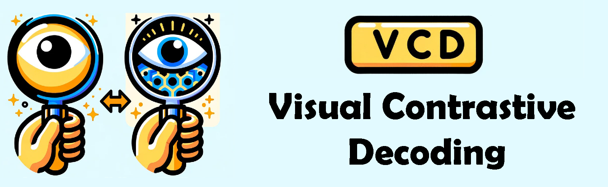
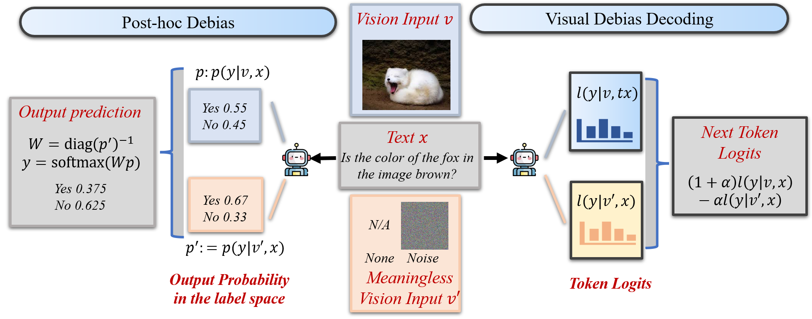
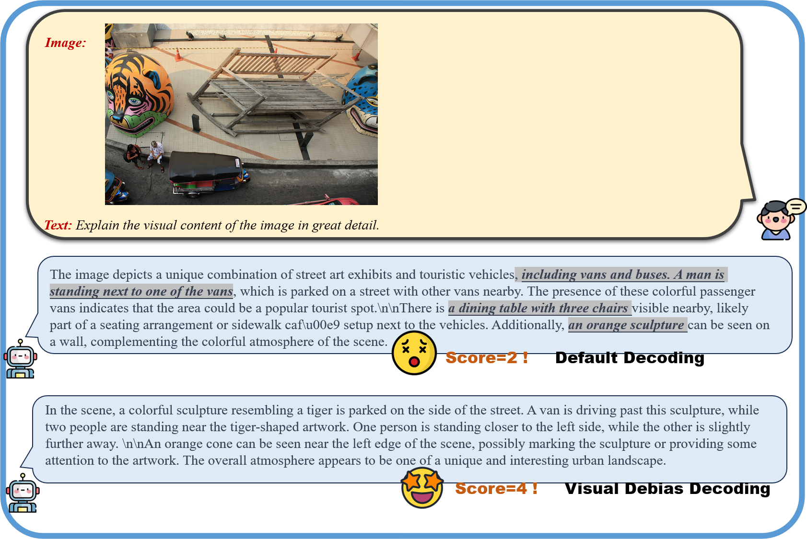
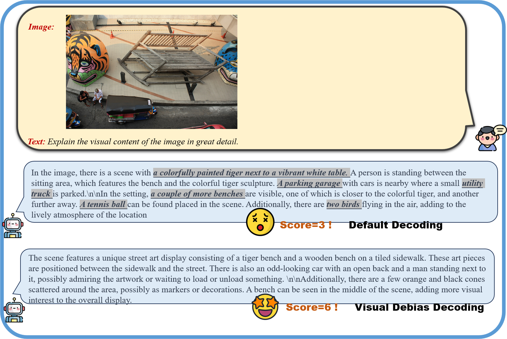
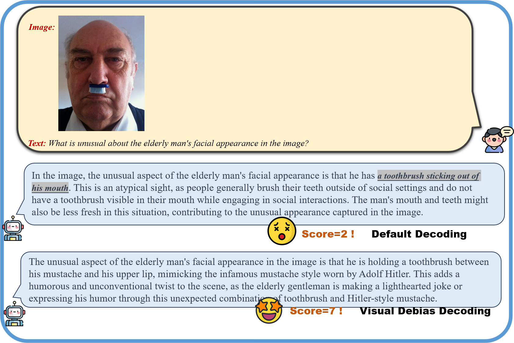

<!-- <p align="center" width="100%">
<a target="_blank"></a>
</p> -->

# Debiasing Large Visual Language Models / Debiasing Multimodal Large Language Models
<!-- **Debiasing Large Visual Language Models** -->
This is the official repo for Debiasing Large Visual Language Models, including a Post-Hoc debias method and Visual Debias Decoding strategy. These strategies not only prove beneficial in minimizing hallucinations but also contribute to the generation of more helpful and precise illustrations

## 🔥 Update
* [2024-03-08]: ⭐️ Paper online. Check out [Debiasing Multimodal Large Language Models](https://arxiv.org/abs/2403.05262) for details.
* [2024-03-11]: 🚀🚀 Codes released.

## 🎯 Overview

- Our investigation reveals a noteworthy bias in the generated content, where the output is primarily influenced by the underlying Language Models (LLMs) rather than the input image.


- We introduce Post-Hoc debias, where a "calibration" step is implemented for the model's output probabilities using an affine transformation.
- We introduce Visual Debias Decoding (VDD), **a simple and training-free** method that contrasts output distributions derived from original and image-free visual inputs.

- These strategies not only prove beneficial in minimizing hallucinations but also contribute to the generation of more helpful and precise illustrations.


## 🕹️ Usage
### Environment Setup
```bash
conda create -yn vdd python=3.9
conda activate vdd
cd LLaVA-Align
pip install -r requirements.txt
```

### Re-implementation of Our Results

For all experiments presented in our paper, refer to the `experiments/scripts` directory for detailed commands and scripts. Below, we provide simple implementation examples and guidance.


### How to Use Post-Hoc Debiasing in LVLMs

To implement Post-Hoc Debiasing in LVLMs, follow these steps:

1. **Obtain Output Distributions:**
   - Generate output distributions with naive image and meaningless vision information, such as pure text input (None) or by replacing vision tokens with `</unk>`.
   - For the POPE benchmark, use the following code to calculate the top-k tokens with their probabilities for each input:
     ```bash
     ./eval/calibrate/llava_calibrate.py
     ```

2. **Initialize Debiasing Weight:**
   - With the obtained naive classification distribution and debiased classification distribution, initialize the debiasing weight $W$ and bias $b$.
   - Adjust the output distribution using affine transformation.

3. **Concrete Example - POPE Binary Classification:**
   - For the POPE binary classification setting, run the following code to see a concrete example:
     ```bash
     ./eval/eval_pope_calibrate.py
     ```

Feel free to modify the parameters or refer to the code for additional details on the implementation of Post-Hoc Debiasing in LVLMs.

### How to Use VDD in LVLMs

To help you get started quickly, here's an example using LLaVA on how to replace the conventional sampling method with the VDD/VCD method during generation:
1. Add the following at the beginning of the start-up script:
```python
from vcd_utils.vcd_sample import evolve_vcd_sampling
evolve_vcd_sampling()
```
The `evolve_vcd_sampling` function replaces the sampling function in the transformers library. The modified sampling function includes an option for visual contrastive decoding, while keeping the rest unchanged.

2. Slightly modify `llava_llama.py`:

   a. Add contrastive decoding parameters in the `LlavaLlamaForCausalLM` class's `forward` function to avoid exceptions in `model.generate`.
   
   b. Add the `prepare_inputs_for_generation_cd` function.

3. set the hyperparameter in the `generate` function:


```python
output_ids = model.generate(
    input_ids,
    images=image_tensor.unsqueeze(0).half().cuda(),
    use_dd=args.use_dd,
    use_dd_unk=args.use_dd_unk,
    cd_alpha = args.cd_alpha,
    cd_beta = args.cd_beta,
    do_sample=True)
```

```
--use_dd: use pure text input for debias decoding
--use_dd_unk: replace the image tokens with </unk> token, the output logits will be used for debias decoding
--use_dd --use_dd_unk: use both of them
```

### How to Test the Effects of Decoding Configurations on LVLMs

To assess the impact of decoding configurations on LVLMs, follow these steps:

1. **Implement For-Loops:**
   - Implement for-loops on the temperature, top-p, and top-k configurations in the decoding process.
   - Collect the results obtained for each configuration.

2. **Evaluate Results:**
   - Evaluate the collected results using a similar approach as described in the preceding sections.

3. **Concrete Example:**
   - For a concrete example for POPE or LLaVA-Bench, run the following code to see how the implementation works:
     ```bash
     ./eval/sampling/llava_sampling.py
     ```


## 📌 Examples
<!-- 
*Figure 12. Qualitative examples showcasing the impact of VDD on LLaVA-v1.5-7B. VDD is demonstrated to be less hallucinated.* -->


*Figure 13. Qualitative examples showcasing the impact of VDD on LLaVA-v1.5-13B. VDD is demonstrated to be less hallucinated.*


*Figure 14. Another Qualitative examples showcasing the impact of VDD on LLaVA-v1.5-13B. VDD is demonstrated to be more helpful and precies.*


## 📑 Citation
If you find our project useful, we hope you can star our repo and cite our paper as follows:
```
@misc{zhang2024debiasing,
      title={Debiasing Large Visual Language Models}, 
      author={Yi-Fan Zhang and Weichen Yu and Qingsong Wen and Xue Wang and Zhang Zhang and Liang Wang and Rong Jin and Tieniu Tan},
      year={2024},
      eprint={2403.05262},
      archivePrefix={arXiv},
      primaryClass={cs.CV}
}
```

## 📝 Related Projects
- [Contrastive Decoding](https://github.com/XiangLi1999/ContrastiveDecoding): Open-ended Text Generation as Optimization
- [Qwen-VL](https://github.com/QwenLM/Qwen-VL): A Versatile Vision-Language Model for Understanding, Localization, Text Reading, and Beyond
- [LLaVA 1.5](https://github.com/haotian-liu/LLaVA): Improved Baselines with Visual Instruction Tuning
- [VCD](https://github.com/DAMO-NLP-SG/VCD/): Visual Contrastive Decoding
